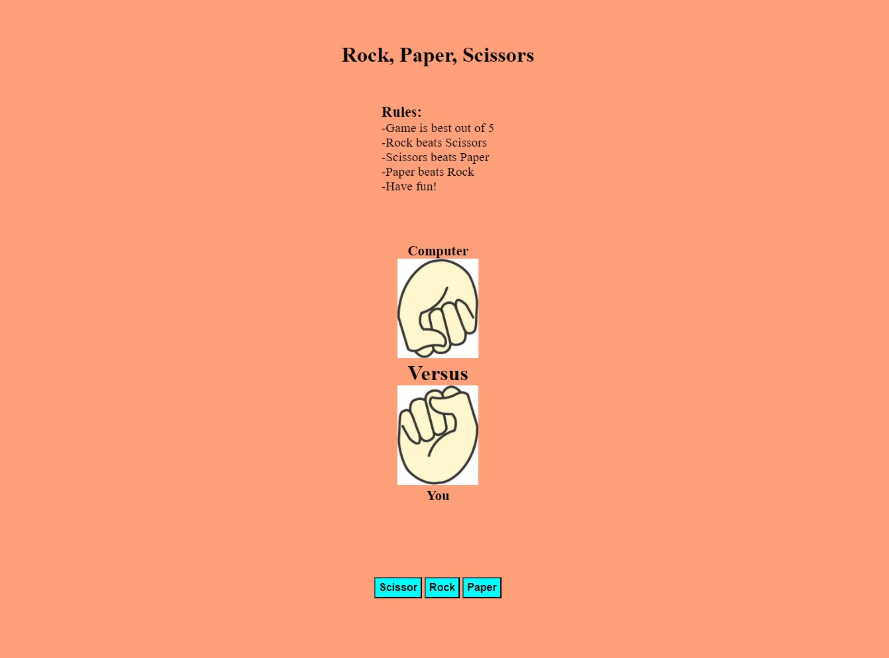

###### Coding Challenge Brought to you by [The Odin Project](https://www.theodinproject.com/)

# Rock, Paper, Scissors game :scissors:

###### Made by Me

 
<strong> Live Application: </strong> <a target="blank_" href="https://kaltang.github.io/RockPaperScissors/">Here</a>  
 
<strong>App type:</strong> Interactive Game 
<strong>Description:</strong> An simple interactive game of Rock, Paper, Scissors VS a computer. 
 
<strong>Languages: </strong> HTML CSS, and JavaScript

 

## :bookmark_tabs: &nbsp; FEATURE LIST

1. User Interface to for options
2. Score keeper
3. Restart the game😵

## :file_folder: &nbsp; SUPPORTING DOCUMENTS

#### Image:

1. Rock paper scissor images. Screenshots taken from [Here](https://www.vecteezy.com/vector-art/12616128-rock-paper-scissors-icon-set-on-white-background)

 
